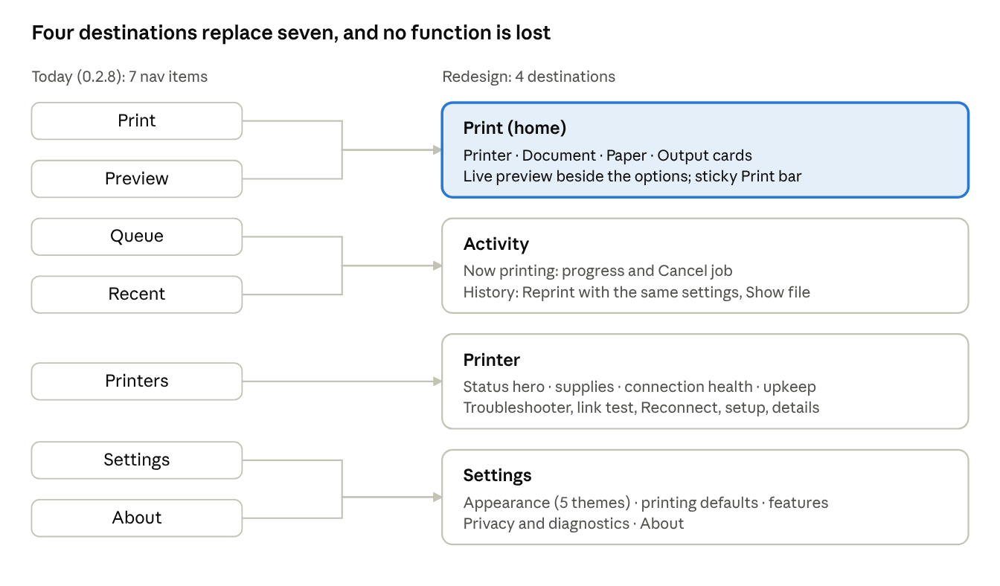
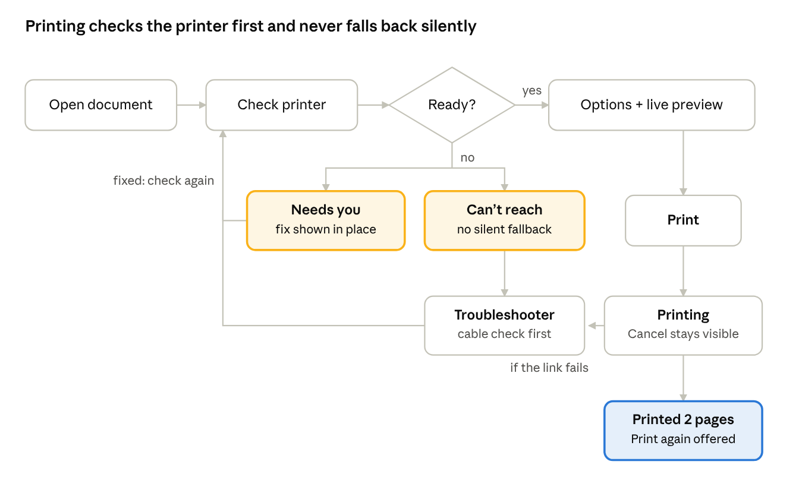

# LinPrinter GUI Guide and Design Reference

> **About this copy.** The UI/UX design and build principles written on 2026-10-02, before
> LinAppTemplate existed, as the brief for LinPrinter's redesign. Exported unchanged from the
> claude.ai document "LinPrinter GUI Guide and Design Reference" (revision 17); its two diagrams
> (navigation, print flow) are rendered from the original as `images/navigation-7-to-4.png` and
> `images/print-flow.png`. It is written for
> LinPrinter but its laws, principles, regulations, components, voice and checklist apply to every
> Lin* app.
>
> **Decided since** (these override the text below; see `.claude/memory/decisions.md`):
> - One theme only, **Graphite Night** (section 10's five themes are design history; no theme picker).
> - Colours live in `lintheme/tokens.py`, not `config_themes.py`; CSS is generated from them.
> - Pages "Range" is **Custom** with a **Page list** box; dropdowns ignore the mouse wheel.
> - Output controls share one width with equal segments.
> - The working rules distilled from this guide are [docs/05-UX.md](../05-UX.md).

Oct 2, 2026 · @Anthropic Claude

## Purpose and scope

This reference is the single brief for redesigning LinPrinter in mockups: every page, flow, component and theme is specified here before any artboard is drawn, and no code in the app changes yet.

It combines four inputs: the app as it ships today (version 0.2.8), the October 2026 TR150 USB incident and what it taught, the ten UX laws and ten 2026 design principles supplied for this redesign, and the accessibility and consumer-protection rules in force as of October 2026.

How to use it:

- Designers work from sections 7 to 12: architecture, flows, tokens, themes, components and page specs.
- Reviewers judge every mockup against sections 4 to 6 and the checklist in section 14.
- Anything the mockups change in the real app later goes through LinPrinter's normal process: a plan, approval, changelog and tests.

Out of scope: network or Wi-Fi printing (LinPrinter is USB-only by design), any AI feature, and accounts or cloud services.

## Users, jobs and context

LinPrinter serves one person printing everyday documents on a USB printer at home or in a small office, and the redesign optimises for the first print of the day succeeding without thought.

| User | What they need most | What hurts them today |
| --- | --- | --- |
| Everyday printer (primary) | Open a file, check it looks right, print it, know it worked | A long options page; no clear "is the printer OK?" answer before pressing Print |
| Photo and card printer | Borderless sizes, paper type, a faithful preview | Paper and borderless choices spread across several controls |
| Household "IT person" | Diagnose a printer that vanished or rejects jobs | Diagnosis lives in logs and a terminal; the app's advice came late and blamed the wrong part |
| Accessibility users (keyboard, screen reader, low vision, tremor) | Full keyboard flow, large targets, readable status | Small segmented targets, status shown mainly by colour |

Jobs to be done, in order of frequency:

1. Print a document I just opened or downloaded.
2. Check pages, paper and colour before using ink and paper.
3. Find out why it didn't print, and fix it.
4. Reprint something from earlier.
5. Look after the printer: ink, test pages, alignment and cleaning.
6. Set my usual defaults once.

Fixed constraints the mockups must respect:

- Linux Mint 22 (Cinnamon), GTK 3 widgets, distro packages only, works fully offline.
- USB only; nothing touches the network; no telemetry, accounts or cloud.
- The printer decides what is possible: options come from what it reports over IPP (for the TR150: 22 sizes, 15 media types, one-sided, 1 to 99 copies, no page ranges on the device).
- Some printer settings (cleaning, alignment, power-off timer) live only on the printer's own local page, because the TR150 has no Set-Printer-Attributes.

## Audit of the current app (0.2.8)

The engine is strong and the screens are honest, but the interface is organised around the app's internals rather than the user's job: seven nav items, a long single-column options form, and printer health split across three places.

| Page today | What it does | Main UX problems |
| --- | --- | --- |
| Print | Find printer, open document, profile, copies, colour, quality, pages, size, type, borderless, fit, summary, Print / Cancel / Preview | 10 option rows at equal weight (Hick); Print button below the fold on small screens (Fitts); preview is a separate page, so the result is recalled, not seen |
| Preview | Exact pages with margins shaded, zoom to 16x, 1 or 2 rows, sets the current page | Disconnected from the options that change it; the user flips between two pages |
| Queue | Jobs table, Cancel, Refresh, auto-refresh | Separate from Recent though both answer "what happened to my print?" |
| Recent | Printed documents, print again, open folder, delete, clear by age | Good; reprint should carry the original settings visibly |
| Printers | Methods, capabilities, firmware, ink gauges, Identify, Reconnect, defaults, test pages, printer's own pages | A long reference sheet; health, setup and specs compete; ink gauges rely on colour |
| Settings | Theme, PDF folder, low-ink level, network notice, features, diagnostics | Reasonable; "Network: Not supported" reads as an error |
| About | Version, compatibility, privacy, licence, files, shortcuts, credits | Fine, but takes a primary nav slot |

Lessons from the October 2026 TR150 incident, which the redesign must turn into interface:

- **The real cause was a cable, and nobody looked there first.** Advice must lead with the cheapest physical check.
- **Status must say where the fault is.** "Not connected", "rejecting jobs" and "HTTP 503" were three symptoms of one link fault, shown in different words in different places.
- **Measurement beats guessing.** A link test (0 of 400 failed versus 50 of 400) settled in seconds what a week of theories didn't; it belongs in the app, one click away.
- **Automatic fallback hid the problem and caused harm.** A silent switch to another route cut off a job and hung the printer. Automated recovery needs visibility and consent.
- **A stray system queue broke other apps.** The app knew about it but had nowhere prominent to say so.

## The ten UX laws, applied

Each law is used at the strength of its evidence: Fitts and Gestalt set hard rules, while Hick, Miller and the Doherty Threshold only guide, because they were never tested on interfaces like this one.

| Law | Evidence | Rule for LinPrinter |
| --- | --- | --- |
| Fitts's Law | Strong | Print is the largest target, 48 px tall, fixed at the bottom right of the Print view, never scrolled away. Destructive actions (cancel job, clear history) are small and placed away from Print. Every target is at least 32 px; frequent ones 40 px. |
| Hick's Law | Narrow (simple stimulus-response) | Not a reason to count menu items. Used only to justify progressive disclosure: four everyday choices visible (printer, copies, colour, paper), the rest under "More options". |
| Jakob's Law | Observation | Follow the GNOME and Cinnamon print-dialog vocabulary: copies, page range, paper size, orientation preview. Header bar, Ctrl+P to print, Ctrl+O to open, Esc to close dialogs. |
| Miller's Law | Misused as "7 items"; working memory is about 4 chunks (Cowan) | Never make users hold settings in mind across screens: the preview sits beside the options, and the summary line restates choices. Group options into at most four visible clusters. |
| Tesler's Law | Sound principle | The system absorbs complexity: page selection, fit, rotation, borderless margins, choosing USB route and recovering the link. Users see outcomes ("Fits on Letter"), not mechanisms ("PWG raster, print-scaling=none"). |
| Doherty Threshold | Directionally right, number dated (1982) | Every click acknowledges within 100 ms. Status checks and preview renders show progress immediately and stream results; anything over 1 s shows what it is doing. |
| Peak-End Rule | Solid in psychology, light in UI | Design the two moments that matter: the error peak (a calm, specific fix) and the end (a clear "Printed 2 pages" with the job time and a reprint shortcut). |
| Aesthetic-Usability Effect | Small original studies | Treated as a bias to test against, not a goal: usability tests use plain prototypes too, so attractive themes can't mask confusing flows. |
| Postel's Law | Engineering principle | Accept any reasonable input: drag and drop, Open With, PDFs, images, text; page ranges like "1-3, 5", "1,2" or "3 to 5". Send the printer only clean, validated jobs (Validate-Job first). |
| Gestalt (proximity, similarity, common region) | Well established | One card per concern: Printer, Document, Paper, Output. Same control type for the same kind of choice. Status sits next to the thing it describes. |

## The ten 2026 design principles, applied

LinPrinter has no AI, so the three AI principles are applied to its automation instead: anything the app does on the user's behalf (choosing a route, reconnecting a printer, changing a queue) is visible, scoped, confirmable and reversible.

| Principle | How LinPrinter applies it |
| --- | --- |
| Accessibility by default | Designed in from the first artboard: keyboard order, focus rings, screen-reader names, 4.5:1 text contrast, no colour-only status, targets of at least 24 by 24 px (WCAG 2.2) and 32 px in practice. |
| Clear AI disclosure | Not applicable: there is no AI and no generated content. The About page says so plainly, so users don't have to wonder. |
| Human control over automated actions | The app never silently switches route or reconnects mid-job. Recovery is offered as a button with its scope stated ("Reconnect this printer on port 3-1; asks for your password"). System changes (removing a stray queue) show the exact command and ask first. |
| Honest uncertainty | Diagnoses carry their evidence and confidence: "Likely the cable (12 of 200 requests failed; your hub on the same port group: 0)", never a guess stated as fact. Unknowns are named: "Can't read the kernel log, so the cause isn't known." |
| No dark patterns | No nagging, fake urgency, pre-checked extras or ink upsells. Low-ink warnings inform; they never block or shame. |
| Easy exit | Cancel is always as visible as Print while a job runs. Every dialog has Cancel and Esc. Optional features turn off in one switch, and leaving Settings never asks "are you sure?". |
| Error prevention over error messages | Only offer what the printer supports; disable impossible combinations with the reason ("Borderless needs photo paper"); check printer status before Print and say what to fix first; confirm only destructive actions. |
| Recognition over recall | Paper sizes shown with a to-scale thumbnail and dimensions; the live preview shows every option's effect; Recent lists the settings used, ready to reuse. |
| Consistency | One status vocabulary (Ready, Busy, Needs you, Can't reach) with one icon and colour each, everywhere; GTK and Cinnamon platform conventions. |
| Performance as UX | Remember the printer and reach it with one request at start; render previews progressively, page 1 first; skeletons only while real work runs, never as decoration. |

## Regulatory and accessibility baseline

The target is WCAG 2.2 Level AA, applied to desktop software through WCAG2ICT and EN 301 549: it is legally required for few of LinPrinter's likely users, but it is the right bar, and it meets every rule below that could apply.

| Rule (as of October 2026) | Applies to LinPrinter? | What the design does |
| --- | --- | --- |
| WCAG 2.2 AA | The working standard; adopted as the design target | Every criterion in the next table |
| US ADA Title II (DOJ rule; deadlines moved to 26 Apr 2027 and 26 Apr 2028) | Only if a state or local government deploys it | AA conformance covers it |
| US ADA Title III | Private-sector services; no technical rule, lawsuits common | AA conformance is the defence |
| European Accessibility Act (EN 301 549) | Listed consumer products and services; a free desktop utility isn't listed | Built to EN 301 549 anyway, so EU distribution stays open |
| EU AI Act, Article 50 | No: no AI system | About page states there is no AI |
| EU DSA Article 25 (dark patterns) | No: not an online platform | Principle adopted voluntarily (section 5) |
| GDPR / ePrivacy | No personal data leaves the machine; no consent flows exist | Local-only logs, redacted serials and paths; diagnostics saved only where the user chooses |
| Click-to-cancel and subscription rules | No subscriptions | Not applicable |
| Children's design codes | Not an online service aimed at children | Not applicable |

WCAG 2.2 criteria that shape these screens most:

| Criterion | Requirement in LinPrinter |
| --- | --- |
| 1.4.1 Use of Color | Every status has an icon and a word; ink gauges carry the percentage in text |
| 1.4.3 / 1.4.11 Contrast | Text 4.5:1 (large 3:1); control borders, focus rings and gauge outlines 3:1, in every theme |
| 1.4.4 / 1.4.10 Resize and reflow | Usable at 200% text scale and at a 640 px wide window without horizontal scrolling |
| 2.1.1 Keyboard | Every function by keyboard; documented shortcuts; no keyboard traps in preview zoom |
| 2.4.7 / 2.4.11 Focus visible, not obscured (2.2) | 2 px focus ring at 3:1; the sticky Print bar never covers the focused control |
| 2.5.8 Target size (2.2) | At least 24 by 24 px; LinPrinter's floor is 32 px |
| 3.3.1 / 3.3.3 Errors and suggestions | Each error names the field or part and the fix |
| 3.3.7 Redundant entry (2.2) | Reprint and profiles reuse earlier settings instead of asking again |
| 3.3.8 Accessible authentication (2.2) | Password prompts come from the system's own polkit dialog, which supports password managers and assistive tech |
| 4.1.2 Name, role, value | Every GTK control has an accessible name; status changes reach the screen reader |
| 4.1.3 Status messages | Printer status, job progress and completion are announced without moving focus |

The legal summary above comes from the brief supplied for this redesign; it hasn't been independently checked, so confirm it before any compliance claim is published.

## Information architecture

The redesign cuts navigation from seven items to four by grouping pages around the user's jobs: printing, checking what happened, looking after the printer, and setting preferences.

Preview joins Print so options and their result are seen together; Queue and Recent become Activity; About moves into Settings. A printer status chip in the header bar is visible on every page and opens Printer.

## Core flows and interaction patterns

The print flow checks the printer before the user commits, fixes problems where they appear, and never reroutes a job without telling the user: the October fallback that hung the printer can't happen by design.

A "Needs you" problem (paper, cover, ink) is fixed on the printer and the check reruns by itself; a "Can't reach" problem opens the Troubleshooter. A link that fails mid-job stops the job and says so; it is never re-sent another way.

Patterns used across the app:

- **Progressive disclosure:** everyday options visible; Odd/Even, Fit and profiles under "More options", which remembers being open.
- **Live preview as feedback:** every option change re-renders the preview within 400 ms, page 1 first, with the paper outline and unprintable margins shaded.
- **Inline status, one vocabulary:** Ready, Busy, Needs you, Can't reach appear in the header chip, the Printer card and the Printer page with the same words and icons.
- **Recovery by consent:** Reconnect, Remove queue and Retry are offered as buttons that state their scope; system changes show the command and ask for the system password through polkit.
- **Troubleshooter ladder, cheapest first:** 1. power and cable seated; 2. another USB cable; 3. test the link (with a known-good device for comparison); 4. power-cycle the printer; 5. another socket; 6. check system queues. It stops at the first step that fixes it and records what was tried.
- **Undo where possible, confirm where not:** removing a history entry can be undone for 10 s; clearing history and removing a system queue are confirmed with a named button.
- **Keyboard first:** Ctrl+O open, Ctrl+P print, Esc cancel dialog, Alt+1 to Alt+4 switch destination, F5 check printer again.

## Visual design system

Every theme is built from one set of named tokens, so a theme changes values, never structure. Colours stay in `config_themes.py` as they do today; the only fixed colours are the ink-cartridge colours and test pages.

**Colour roles** (each theme sets every role; contrast is checked per theme in section 10):

| Role | Use | Minimum contrast |
| --- | --- | --- |
| `bg` | Window background | — |
| `surface` / `surface-raised` | Cards / popovers, dialogs | Border 3:1 against `bg` where the edge carries meaning |
| `border` / `border-strong` | Dividers / control outlines | 3:1 for control outlines |
| `text` / `text-muted` | Body / secondary text | 4.5:1 on `surface` for both |
| `accent` / `on-accent` | Primary button, selection / text on it | 4.5:1 text on accent; accent 3:1 against `surface` |
| `focus` | Focus ring, 2 px plus 2 px offset | 3:1 against adjacent colours |
| `ok`, `busy`, `attention`, `error` (+ `-bg` tints) | Status: Ready, Busy, Needs you, Can't reach | Icon and text 4.5:1; always paired with an icon and a word |

**Type** (system UI font: Ubuntu on Mint; tabular figures for numbers):

| Token | Size / line height | Weight | Use |
| --- | --- | --- | --- |
| `display` | 28 / 36 | 600 | Status hero on Printer page |
| `title` | 20 / 28 | 600 | Page titles |
| `heading` | 16 / 24 | 600 | Card titles |
| `body` | 14 / 21 | 400 | Everything else |
| `caption` | 12 / 18 | 400 | Hints, metadata; never below 12 |

**Space, shape and size:**

- Spacing on a 4 px base: 4, 8, 12, 16, 24, 32, 48. Cards pad 16; gaps between cards 16; page margins 24.
- Radius: 6 for controls, 10 for cards, 14 for dialogs; status chips fully rounded.
- Control heights: 32 px standard, 40 px for frequent actions, 48 px for Print.
- Layout: minimum window 720 by 540; two panes from 960 px wide, with options 380 to 440 px and the preview taking the rest; one column below 960 with the preview as a collapsible strip.
- Elevation: three levels only (flat, card, overlay), shown by border and tint first, shadow second, so the high-contrast theme works.

**Icons:** Phosphor (already bundled, MIT): 20 px in buttons, 24 px in navigation, regular weight, fill weight only for the active nav item. Every icon has a text label or an accessible name.

**Motion:** 120 ms ease-out for state changes, 200 ms for panels and dialogs, none for status updates. When GTK animations are off, or reduce-motion is set, every transition becomes instant. No looping animation except a progress spinner while real work runs.

## Theme directions for the mockups

Five themes, all passing WCAG 2.2 AA on every role pair: the lowest text contrast is 6.7:1 (needed: 4.5:1), and High Contrast reaches AAA at 16.8:1 or more. Every mockup is drawn in Mint Daylight first, then shown in the other four.

| Theme | Character | bg / surface | Text / muted | Accent / on-accent | Focus | ok · busy · attention · error |
| --- | --- | --- | --- | --- | --- | --- |
| **Mint Daylight** (default light) | Native to Linux Mint: calm, green-accented, high clarity | `#f4f6f5` / `#ffffff` | `#1b2420` / `#4f5d57` | `#1f7a4d` / `#ffffff` | `#1559b8` | `#1f7a4d` · `#1559b8` · `#8a5300` · `#b3261e` |
| **Graphite Night** (default dark) | Today's dark look, refined: neutral greys, blue accent, amber focus | `#1c1f23` / `#262a30` | `#eceff3` / `#aab2bd` | `#4c9dff` / `#0b1320` | `#ffd75e` | `#5fd38d` · `#7cb7ff` · `#ffbf4d` · `#ff8a80` |
| **Paper & Ink** | Warm, editorial, print-shop feel: cream paper, indigo ink | `#f6f1e7` / `#fffdf8` | `#22201c` / `#5a5348` | `#3a3a9e` / `#ffffff` | `#b8431b` | `#2d6a3e` · `#3a3a9e` · `#8a4b00` · `#a4262c` |
| **CMYK Studio** | Dark, technical, colour-proofing mood: cyan accent, magenta focus | `#101820` / `#17222d` | `#f2f6fa` / `#a9b8c7` | `#00b7eb` / `#06121a` | `#ff4fa3` | `#4fd18b` · `#00b7eb` · `#ffd23f` · `#ff7a7a` |
| **High Contrast** | Maximum legibility for low vision; black, white, yellow | `#000000` / `#000000` | `#ffffff` / `#e6e6e6` | `#ffd400` / `#000000` | `#00e5ff` | `#7dff9b` · `#7fd4ff` · `#ffd400` · `#ff9e9e` |

Measured contrast of the weakest required pair per theme:

| Theme | Muted text on surface (≥ 4.5) | Text on accent (≥ 4.5) | Control border (≥ 3) | Focus on bg (≥ 3) | Weakest status colour (≥ 4.5) |
| --- | --- | --- | --- | --- | --- |
| Mint Daylight | 6.9 | 5.3 | 3.6 | 6.1 | 5.3 (ok) |
| Graphite Night | 6.7 | 6.7 | 3.9 | 11.9 | 6.3 (error) |
| Paper & Ink | 7.5 | 9.2 | 4.1 | 4.8 | 6.4 (ok) |
| CMYK Studio | 8.0 | 8.1 | 4.1 | 5.9 | 6.4 (error) |
| High Contrast | 16.8 | 14.7 | 21.0 | 13.7 | 10.6 (error) |

Rules that hold in every theme:

- "Follow the system" is the default setting: light and dark switch with Cinnamon's preference; High Contrast follows the GTK high-contrast setting.
- Status never relies on hue alone: Ready is a check, Busy a spinner, Needs you a hand, Can't reach a broken link, each with its word.
- Ink gauges use the cartridge colours (fixed, not themed) inside a themed outline, with the percentage as text.

## Component library

Fifteen components cover every page; each is drawn once on a component sheet with all its states before any page mockup uses it.

| Component | Built from (GTK 3) | States to draw | Rules |
| --- | --- | --- | --- |
| Header bar | GtkHeaderBar | Normal, with job running | Title, printer status chip, menu (Shortcuts, Help, About); Ctrl+P / Ctrl+O hints in tooltips |
| Navigation rail | GtkStackSidebar-style list | Default, hover, active, focus, with badge | 4 items with icon and label; badge on Activity while a job runs; keyboard Alt+1 to Alt+4 |
| Printer status chip | Button with icon and label | Ready, Busy, Needs you, Can't reach, Checking | Always visible; opens the Printer page; announces changes to screen readers |
| Card | GtkFrame with heading | Default, attention, disabled | One concern per card; heading 16/600; optional action at top right |
| Segmented choice | Linked toggle buttons | Default, hover, selected, focus, disabled with reason | 2 to 4 options only; arrow keys move; more than 4 becomes a dropdown |
| Dropdown with preview | GtkComboBox with rich rows | Closed, open, focused, disabled | Paper sizes show a to-scale thumbnail and dimensions; grouped (Common, Photo, Envelopes, Other) |
| Stepper | Spin button with − / + | Default, min, max, invalid | Copies 1 to 99; typing allowed; out-of-range clamps with a message |
| Page-range field | Entry with parser | Empty, valid, invalid with hint | Accepts "1-3, 5", "1,2", "3 to 5"; shows "4 pages" live |
| Primary button | GtkButton, suggested-action | Default, hover, pressed, focus, busy, disabled with reason | One per view; Print is 48 px tall |
| Destructive button | GtkButton, destructive-action | Same as primary | Always behind a confirm dialog naming what goes |
| Live preview | Drawing area with thumbnails | Rendering (page 1 first), ready, error, zoomed | Margins shaded; B&W shown grey; keyboard zoom (Ctrl + / − / 0) |
| Status banner | GtkInfoBar | Info, attention, error, success | Says what happened, why, and the one next step; never auto-dismisses errors |
| Ink gauge | Level bar with label | Normal, low, empty, unknown | Cartridge colour fill, themed outline, percentage text, "Low" word at or below the alert level |
| Job row | List row | Queued, printing (progress), done, cancelled, failed | Cancel on active rows; Reprint and Show file on finished rows |
| Dialog | GtkDialog | Confirm, destructive confirm, progress, result | Title is the question; buttons are verbs ("Remove queue", "Keep it"); Esc cancels |

## Page-by-page specifications

Four destinations replace seven: Print (with the preview built in), Activity (Queue and Recent merged), Printer (health first, then upkeep and details) and Settings (with About folded in). Every function of 0.2.8 survives; none is removed.

### Print (home)

- **Layout:** two panes. Left: four cards (Printer, Document, Paper, Output). Right: live preview. Bottom: a sticky action bar with the summary line, Cancel and a 48 px Print button.
- **Printer card:** the chosen printer with its status word and icon, a printer menu (Find again, Print to PDF, Manage printers). When status is not Ready, the card shows the reason and its one fix in place.
- **Document card:** Open (Ctrl+O), drop zone, file name and page count; replace by dropping another file.
- **Paper card:** size (dropdown with thumbnails), type, borderless switch (disabled with reason where the size or type can't do it).
- **Output card:** copies, colour (Colour / Black & white), quality (Draft / Normal / High), pages (All / Range / Current). "More options" reveals Odd / Even pages, Fit to page / Actual size and profiles.
- **States to mock:** first run with no printer; no document; ready; printer needs paper; printing with progress; printed (end moment); Print to PDF saved; printer can't be reached with the link-failing reason.

### Activity

- **Now printing:** active jobs with document, printer, progress ("Page 1 of 2"), elapsed time and Cancel job.
- **History:** finished prints, newest first, with date, pages, settings used and result; Reprint (same settings, editable), Show file, Remove; Clear older than (30, 90, 365 days), behind a confirm.
- **States:** empty, one active job, failed job with its reason, long history with filter.

### Printer

- **Status hero:** large status (Ready, Busy, Needs you, Can't reach) with what it means and the next step; Check connection button.
- **Supplies:** ink gauges (Colour, Black) with percentage text; paper loaded; Ink details (the printer's local page).
- **Connection health:** USB port, speed, route (Direct IPP or System queue), recent link errors; Test connection runs the link test with a plain result; Reconnect with its scope stated; stray system queues listed with Remove.
- **Upkeep:** Identify (flash), Print quality page, Print line page, Look first (preview a test page), Printer settings and maintenance (the printer's local page).
- **Setup:** the printer's own defaults and "Use these in LinPrinter".
- **Details (collapsed):** capabilities, firmware, model, sizes, types, connection URIs.
- **States:** healthy; low ink; paper out; link failing; stray queue found; printer missing (remembered); test running.

### Troubleshooter (opened from any "Can't reach" status)

A guided, one-question-per-step flow: check power and cable, try another cable, test the link, power-cycle, try another socket, check system queues. Each step shows what to do, a "Check now" button and the measured result, and it stops at the first step that fixes it.

### Settings

- **Appearance:** theme (Follow system, the five themes) with live thumbnails; text size follows the system.
- **Printing:** default printer behaviour, Print to PDF folder, low-ink alert level, optional features (Ink alerts, Print profiles) as switches with one-line descriptions.
- **Privacy and diagnostics:** what the app stores and where, USB-only statement, Save diagnostics.
- **About:** version, licence (CC BY-NC 4.0), "no AI, no network, no telemetry", credits, keyboard shortcuts.

### Dialogs and overlays to mock

Open file; page range; save profile; Reconnect (scope plus the system password prompt); Remove system queue (shows the command); Clear history; Cancel a running job; Print anyway with low ink; Print to PDF saved (with Open folder); keyboard shortcuts overlay; first-run welcome (find printer, choose theme).

## Content and voice

LinPrinter speaks like a calm, competent neighbour: plain words, the specific fact, then the one thing to do. Every status and error message follows the same three-part pattern.

**Pattern:** what happened · why (with evidence, if known) · the next step as a button or a short instruction.

| Situation | Write | Don't write |
| --- | --- | --- |
| Link failing | "The printer keeps dropping off USB (14 errors on port 3-3 in 10 minutes). Try another USB cable first." \[Test connection\] | "USB error -71 (EPROTO)" |
| Paper out | "Load paper in the rear tray, then press Print again." | "media-empty-error" |
| Printer stuck | "The printer stopped answering mid-job. Turn it off and on, then press Retry." | "HTTP 503 Service Unavailable" |
| Stray queue | "Another print setting points your printer at a serial port, so Print in other apps fails." \[Remove it…\] | "Misdirected CUPS queue detected" |
| Printed | "Printed 2 pages on Canon TR150 · 62 s" \[Print again\] | "Job 1: job-completed-successfully" |
| Low ink | "Black ink is at 8%. You can still print; the page may look faint." \[Print anyway\] \[Cancel\] | "WARNING: LOW INK!" |

Rules:

- Sentence case everywhere; buttons are verbs ("Print", "Remove queue", "Keep it").
- Numbers with units and counts ("2 pages", "62 s", "60%"); dates relative when recent ("Today, 00:54").
- Technical detail lives behind "Details" for the household IT person, never in the headline.
- Name the user's object, not the system's: "your printer", "this document", not "destination" or "job attributes".
- Never blame the user; never use urgency words ("immediately", "critical") unless something will be lost.
- One message per problem: the same fault reads the same in the status chip, the Printer page and the Troubleshooter.

## Acceptance checklist and test plan

A mockup is accepted only when it passes every item below; the usability tests then run on clickable prototypes before any code changes.

Per artboard:

- [ ] Every interactive element is at least 32 by 32 px (WCAG floor 24); Print is 48 px tall
- [ ] Text contrast at least 4.5:1, borders and focus at least 3:1, in all five themes
- [ ] Every status shows an icon and a word, not colour alone
- [ ] Focus order drawn as numbered overlay; focus never hidden behind the sticky bar
- [ ] Works at a 720 px window and at 200% text without horizontal scrolling
- [ ] Every control has its accessible name noted on the spec layer
- [ ] Disabled controls state why
- [ ] No more than four visible option groups before "More options"
- [ ] Copy follows the three-part pattern (section 13)
- [ ] Destructive actions are confirmed and named; none sits next to Print

Usability test plan (5 participants per round, including at least one keyboard-only and one screen-reader user):

| Task | Success means | Target |
| --- | --- | --- |
| Print a 2-page PDF on Letter | Printed without help | 5 of 5, under 30 s |
| Print page 3 only, black and white | Correct page and colour on first try | 4 of 5 |
| Print a borderless 4x6 photo | Finds the setting, correct paper type | 4 of 5 |
| "The printer isn't printing" (link failure simulated) | Reaches the cable advice and runs the link test | 4 of 5, under 2 min |
| Reprint last week's document | Uses Activity, keeps settings | 5 of 5 |
| Cancel a job in progress | Cancels within 2 actions | 5 of 5 |
| Switch to High Contrast | Finds and applies the theme | 5 of 5 |

Also measured: System Usability Scale (target 80 or more) and the end-moment rating after each print (1 to 5). The aesthetic-usability bias is checked by running the first round on a greyscale wireframe.

## Mockup plan and deliverables

The mockups come as one design canvas of about 40 artboards at 1200 by 800 (the app's screenshot size), drawn in Mint Daylight, with the key screens repeated in the other four themes; no app code changes.

| Group | Artboards | Count |
| --- | --- | --- |
| Foundations | Colour roles per theme, type scale, spacing and grid, icons, status vocabulary | 5 |
| Components | The 15 components with all states (section 11) | 3 sheets |
| Print | First run, no document, ready, More options open, needs paper, printing, printed, PDF saved, can't reach, narrow window | 10 |
| Activity | Empty, active job, history, failed job | 4 |
| Printer | Healthy, low ink, link failing, stray queue, printer missing, test running | 6 |
| Troubleshooter | Cable step, link test running, link test result, resolved | 4 |
| Settings | Appearance, Printing, Privacy, About | 4 |
| Dialogs | Reconnect, Remove queue, Clear history, Cancel job, Low ink, Shortcuts | 6 |
| Themes | Print (ready) and Printer (link failing) in each of the four other themes | 8 |

Review order:

1. Information architecture and the Print flow in greyscale (checks the structure before any style).
2. Components and Mint Daylight screens.
3. The other themes and the accessibility pass (section 14 checklist).
4. Clickable prototype of Print, Troubleshooter and Activity for the usability round.
5. Approved changes go to the real app as a planned release (plan, approval, changelog, tests).

## Sources and caveats

This reference draws on the redesign brief and LinPrinter's own repository; no web pages were opened while writing it, so external standards are named for follow-up, not quoted.

- **Redesign brief** (supplied 2026-10-02): the ten UX laws with evidence notes, ten 2026 design principles, and the regulatory summary as of October 2026. Legal statements in section 6 come from it and need checking before any compliance claim.
- **LinPrinter 0.2.8 repository** ([github.com/MensuraMedia/linprinter](https://github.com/MensuraMedia/linprinter)): README, docs/FEATURES.md, docs/TECHNICAL.md, docs/USB-TROUBLESHOOTING.md, the page code and the 17 walkthrough screenshots (the audit in section 3).
- **TR150 incident record** (2026-09-21 to 2026-10-02): kernel and ipp-usb logs and the link-test measurements behind section 3's lessons.
- **Contrast figures** in section 10 were computed with the WCAG 2.x relative-luminance formula for each palette pair.
- **Standards to read before sign-off:** WCAG 2.2, WCAG2ICT (applying WCAG to non-web software), EN 301 549, GNOME Human Interface Guidelines (for Jakob's Law alignment on Linux).

Open questions:

- Should About stay inside Settings, or move to the header menu only?
- Is "Activity" the clearest name for jobs and history, or would users look for "Jobs"? (Test in round 1.)
- Does a 960 px two-pane breakpoint suit the smallest screens LinPrinter users have?
